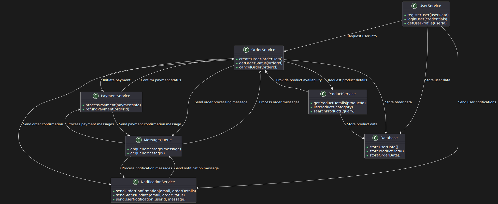

# Пользовательские сценарии интернет-магазина "Чайная Утопия" 

---  
  
## 1. Пользовательские сценарии  
  
### История: Поиск и просмотр чайных товаров
**Как** покупатель    
**Чтобы** легко находить   
**И**  приобретать чайные товары    
**Я хочу** иметь возможность искать  
**И**  просматривать товары в интернет-магазине.  
  
### Сценарий 1: Поиск чая по названию  
**Дано** то, что клиент авторизован    
**И** находится на главной странице интернет-магазина "Чайная Утопия"    
**Когда** клиент вводит в строке поиска "Зеленый чай"    
**Тогда** появляется список чаев, подходящих под запрос клиента    
**И** в карточке товара пользователь видит:  
1. название  
2. цену  
3. изображение  
4. скидку  
5. описание вкуса и аромата  
  
### Сценарий 2: Переход на страницу товара из списка  
**Дано** то, что клиент авторизован    
**И** видит список чаев, включая товар "Зеленый чай"    
**Когда** клиент нажимает на карточку товара "Зеленый чай"    
**Тогда** он переходит на страницу с описанием товара  
  
### Сценарий 3: Добавление товара в корзину  
**Дано** то, что клиент авторизован    
**И** находится на странице товара "Зеленый чай"    
**Когда** клиент нажимает кнопку "Добавить в корзину"    
**Тогда** товар "Зеленый чай" добавляется в корзину  
  
### Сценарий 4: Оформление заказа с товаром в корзине  
**Дано**, что клиент авторизован    
**И** имеет товар "Зеленый чай" в корзине    
**Когда** клиент переходит на страницу "Корзина"    
**И** нажимает кнопку "Оформить заказ"    
**Тогда** клиент видит страницу подтверждения заказа с деталями о покупке  
  
### Сценарий 5: Добавление нового чая администратором  
**Дано** то, что администратор интернет-магазина "Чайная Утопия" авторизован    
**Когда** администратор переходит на страницу "Добавить товар"    
**И** заполняет форму с данными о новом чае    
**И** нажимает кнопку "Сохранить"    
**Тогда** новый товар появляется в каталоге товаров  
  
### Сценарий 6: Редактирование информации о товаре администратором  
**Дано** то, что администратор интернет-магазина "Чайная Утопия" авторизован     
**И** находится на странице редактирования товара "Зеленый чай"    
**Когда** администратор изменяет информацию о товаре    
**И** нажимает кнопку "Сохранить"    
**Тогда** изменения сохраняются    
**И** отображаются в каталоге товаров  
  
### Сценарий 7: Просмотр всех заказов администратором  
**Дано** то, что администратор интернет-магазина "Чайная Утопия" авторизован    
**Когда** администратор переходит на страницу "Заказы"    
**Тогда** администратор видит список всех заказов пользователей  
  
### Сценарий 8: Отслеживание статуса заказа покупателем  
**Дано** то, что клиент авторизован    
**И** имеет активный заказ    
**Когда** клиент переходит на страницу "Мои заказы"    
**Тогда** он видит статус своего заказа  
  
---  
  
## 2. Общая схема взаимодействия сервисов  
  

---  
  
## 3. Назначение и зона ответственности сервисов  
  
### 1. User Service  
**Назначение**: Управление пользовательскими аккаунтами.  
  
**Зона ответственности**:  
- Регистрация и аутентификация пользователей  
- Хранение и обновление профилей пользователей  
- Обеспечение безопасности пользовательских данных  
  
### 2. Product Service  
**Назначение**: Управление каталогом товаров.  
  
**Зона ответственности**:  
- Хранение информации о товарах  
- Обработка поисковых запросов  
- Управление наличием товаров на складе  
  
### 3. Order Service  
**Назначение**: Обработка заказов.  
  
**Зона ответственности**:  
- Создание и управление заказами  
- Отслеживание статуса заказов  
- Координация процесса выполнения заказа  
  
### 4. Payment Service  
**Назначение**: Обработка платежей.  
  
**Зона ответственности**:  
- Проведение транзакций  
- Интеграция с платежными системами  
- Обеспечение безопасности финансовых операций  
  
### 5. Notification Service  
**Назначение**: Отправка уведомлений пользователям.  
  
**Зона ответственности**:  
- Отправка email и SMS уведомлений  
- Информирование о статусе заказа  
- Отправка маркетинговых сообщений  
  
---  

## 4. Контракты взаимодействия сервисов  
  
### User Service <---> Order Service  

- Order Service запрашивает данные пользователя для оформления заказа  
- User Service предоставляет информацию о пользователе (имя, адрес доставки)  
  
### Order Service <---> Product Service  
- Order Service запрашивает информацию о товарах для заказа  
- Product Service предоставляет детали товаров и проверяет их наличие  
  
### Order Service <---> Payment Service  
- Order Service инициирует процесс оплаты  
- Payment Service обрабатывает платеж и возвращает статус транзакции  
  
### Order Service <---> Notification Service  
- Order Service запрашивает отправку уведомления о статусе заказа  
- Notification Service подтверждает отправку уведомления  
  
### User Service <---> Notification Service  
- User Service запрашивает отправку уведомления о регистрации или изменении пароля  
- Notification Service подтверждает отправку уведомления

