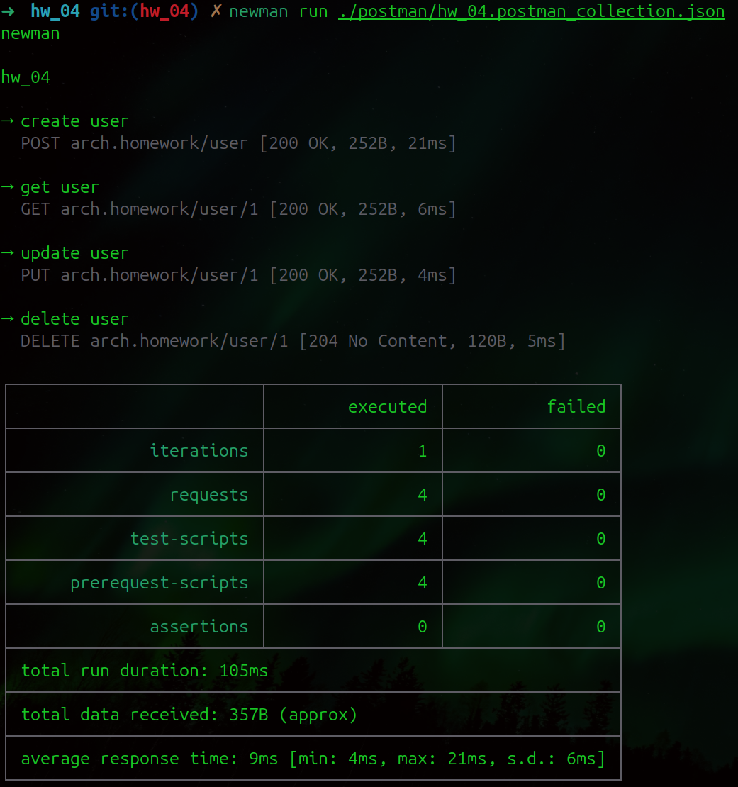

# Инструкция по установке и запуску чарта

### 1. Создать namespace `m` и установить `nginx ingress` контроллер:

```bash
kubectl create namespace m && helm repo add ingress-nginx https://kubernetes.github.io/ingress-nginx/ && helm repo update && helm install nginx ingress-nginx/ingress-nginx --namespace m --create-namespace --set controller.service.externalIPs={$(minikube ip)}
```

### 2. Установить `postgres`:

```bash
helm upgrade --install postgresql oci://registry-1.docker.io/bitnamicharts/postgresql --namespace=m -f  "./crud-app-chart/values.yaml"
```

### 3. Установить чарт:

```bash
helm upgrade --install crud-app ./crud-app-chart -n m 
```

### 4. Для проверки работоспособности запустить `Postman` коллекцию:

```bash
newman run ./postman/hw_04.postman_collection.json
```

---

### Результат выполнения коллекции:
